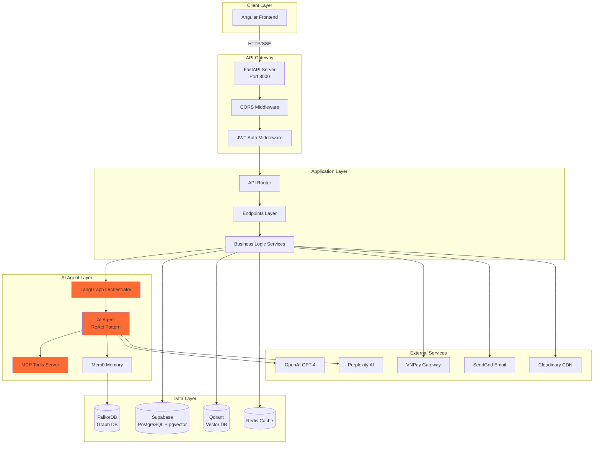
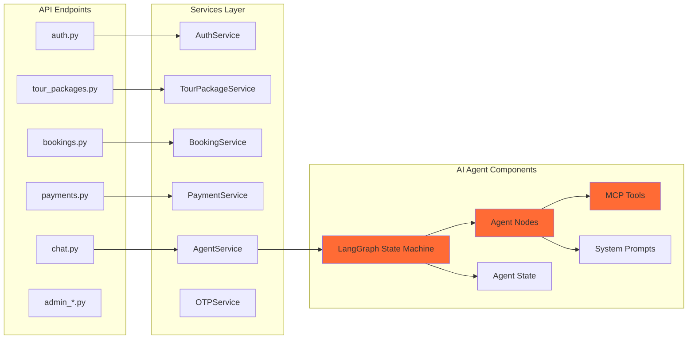
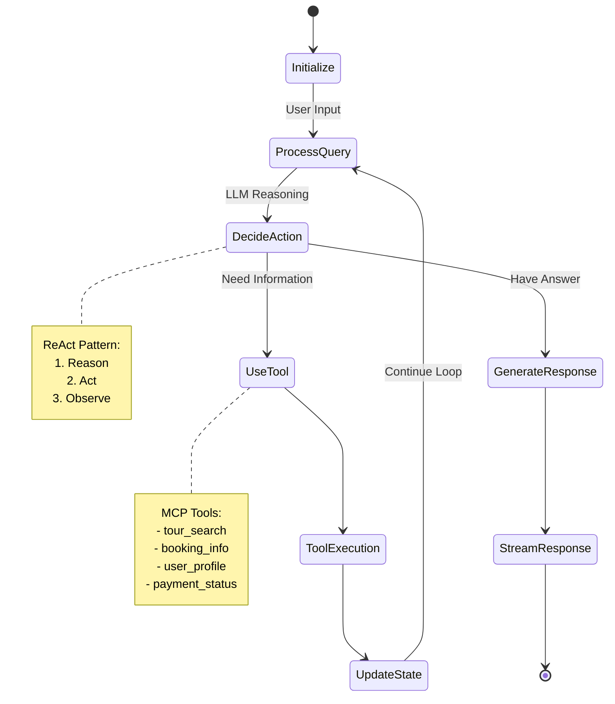
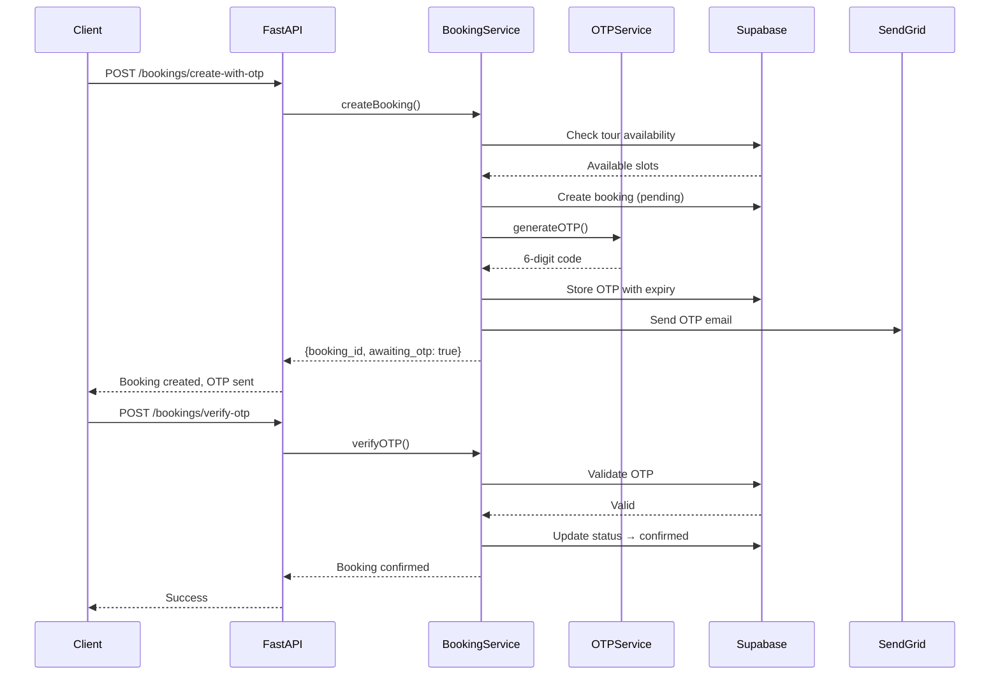
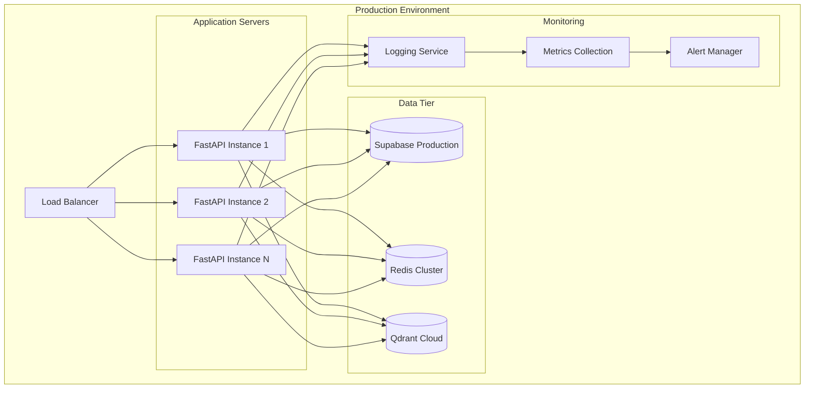

<p align="center">
  
  
  
  
  
</p>

<h1 align="center">🌍 AI Tour Booking System - Backend</h1>

<p align="center">
  <strong>Hệ thống đặt tour du lịch thông minh với AI Agent, MCP Tools và tìm kiếm ngữ nghĩa</strong>
</p>

<p align="center">
  <a href="#-tính-năng">Tính năng</a> •
  <a href="#-system-architecture">Architecture</a> •
  <a href="#-tech-stack">Tech Stack</a> •
  <a href="#-cài-đặt">Cài đặt</a> •
  <a href="#-api-endpoints">API</a>
</p>

---

## ✨ Tính năng

### 🔐 Authentication & Authorization
- Đăng nhập/Đăng ký bằng Email với xác thực JWT
- OAuth 2.0 với Google
- Phân quyền Admin/User
- Xác thực OTP qua Email (SendGrid)

### 🎫 Quản lý Tour & Booking
- CRUD Tour Packages với quản lý slots
- Đặt tour với xác thực OTP
- Áp dụng Promotion/Voucher
- Thanh toán VNPay
- Quản lý trạng thái booking

### 🤖 AI-Powered Features
- **LangGraph Agent**: Multi-step reasoning với ReAct pattern
- **MCP Tools Integration**: Modular tool system cho AI agent
- **Semantic Search**: Tìm kiếm tour bằng vector embeddings (Qdrant)
- **Admin Support Agent**: AI hỗ trợ quản trị viên
- **Travel News Agent**: Cập nhật tin tức du lịch tự động

### 📊 Analytics & Reports
- Dashboard thống kê doanh thu
- Báo cáo booking theo thời gian
- Quản lý reviews & ratings

---

## 🏗 System Architecture

### High-Level Architecture



### Component Architecture



### AI Agent Architecture (LangGraph)



### Data Flow - Booking with OTP



### Database Schema

```
┌─────────────────┐     ┌─────────────────┐     ┌─────────────────┐
│     users       │     │  tour_packages  │     │    bookings     │
├─────────────────┤     ├─────────────────┤     ├─────────────────┤
│ user_id (PK)    │     │ package_id (PK) │     │ booking_id (PK) │
│ email           │     │ package_name    │     │ package_id (FK) │
│ phone_number    │     │ destination     │     │ user_id (FK)    │
│ full_name       │     │ description     │     │ number_of_people│
│ password_hash   │     │ duration_days   │     │ total_amount    │
│ login_type      │     │ price           │     │ contact_*       │
│ role            │     │ available_slots │     │ status          │
│ is_active       │     │ start/end_date  │     │ created_at      │
└────────┬────────┘     │ image_urls      │     └────────┬────────┘
         │              │ cuisine         │              │
         │              │ suitable_for    │              │
         │              └────────┬────────┘              │
         │                       │                       │
         │                       │                       │
┌────────┴────────┐     ┌────────┴────────┐     ┌───────┴─────────┐
│    payments     │     │    reviews      │     │   promotions    │
├─────────────────┤     ├─────────────────┤     ├─────────────────┤
│ payment_id (PK) │     │ review_id (PK)  │     │ promotion_id    │
│ booking_id (FK) │     │ user_id (FK)    │     │ code            │
│ amount          │     │ package_id (FK) │     │ discount_type   │
│ payment_method  │     │ rating          │     │ discount_value  │
│ payment_status  │     │ content         │     │ valid_from/to   │
│ transaction_id  │     │ created_at      │     │ max_uses        │
└─────────────────┘     └─────────────────┘     └─────────────────┘

┌─────────────────────────┐     ┌─────────────────────────┐
│   package_embeddings    │     │    conversation_logs    │
├─────────────────────────┤     ├─────────────────────────┤
│ package_id (FK)         │     │ conversation_id (PK)    │
│ embedding (vector[1536])│     │ user_id (FK)            │
│ text_content            │     │ messages (JSONB)        │
│ updated_at              │     │ created_at              │
└─────────────────────────┘     └─────────────────────────┘
```

### Deployment Architecture



---

## 🛠 Tech Stack

| Category | Technologies |
|----------|-------------|
| **Framework** | FastAPI 0.112+, Pydantic 2.x |
| **Database** | Supabase (PostgreSQL + pgvector) |
| **Cache** | Redis |
| **AI/ML** | LangChain, LangGraph, OpenAI GPT-4, Qdrant |
| **MCP** | FastMCP, mcp-ui-server |
| **Memory** | Mem0 (Long-term AI memory) |
| **Graph DB** | FalkorDB (for Graphiti) |
| **Auth** | JWT, bcrypt, Google OAuth |
| **Payment** | VNPay |
| **Email** | SendGrid |
| **Media** | Cloudinary |
| **Scheduler** | APScheduler |
| **Deploy** | Docker, Modal |
| **Package Manager** | uv |

---

## 📁 Cấu trúc dự án

```
Backend/
├── main.py                     # FastAPI application entry
├── pyproject.toml              # Dependencies & project config
├── agent.yaml                  # Customer AI agent config
├── admin_agent.yaml            # Admin AI agent config
├── Dockerfile                  # Docker container config
├── docker-compose.yml          # Docker services
├── migrations/                 # Alembic database migrations
├── tests/                      # Unit & integration tests
├── docs/                       # API documentation
└── app/
    └── v1/
        ├── api/
        │   ├── router.py       # Main API router
        │   └── endpoints/      # API endpoint handlers
        │       ├── auth.py             # Authentication
        │       ├── tour_packages.py    # Tour CRUD & search
        │       ├── bookings.py         # Booking management
        │       ├── payments.py         # VNPay integration
        │       ├── chat.py             # AI chatbot streaming
        │       ├── reviews.py          # Review system
        │       ├── promotions.py       # Voucher/Promo
        │       ├── admin_*.py          # Admin endpoints
        │       └── ...
        ├── core/
        │   ├── config.py       # Environment settings
        │   └── logging_config.py
        ├── schema/             # Pydantic request/response models
        ├── model/              # Database models
        ├── services/           # Business logic
        │   ├── auth_service.py
        │   ├── booking_service.py
        │   ├── payment_service.py
        │   ├── tour_package_service.py
        │   ├── agent_services/         # AI agent implementations
        │   │   ├── agents/             # Agent definitions
        │   │   ├── graphs/             # LangGraph state machines
        │   │   ├── nodes/              # Graph nodes
        │   │   ├── tools/              # Agent tools
        │   │   ├── memory/             # Memory management
        │   │   └── prompts/            # System prompts
        │   ├── agent_support_admin/    # Admin AI agent
        │   └── ...
        └── mcp/
            └── src/tools/      # MCP Tools for AI agents
                ├── booking_tools.py
                ├── tour_search_tools.py
                ├── user_tools.py
                └── ...
```

---

## 🚀 Cài đặt

### Prerequisites

- Python 3.10+
- [uv](https://docs.astral.sh/uv/) (recommended) hoặc pip
- Supabase account
- OpenAI API key
- VNPay merchant account (for payments)

### 1. Clone & Navigate

```bash
cd Backend
```

### 2. Install uv (recommended)

```powershell
# Windows (PowerShell)
irm https://astral.sh/uv/install.ps1 | iex
```

```bash
# Linux/macOS
curl -LsSf https://astral.sh/uv/install.sh | sh
```

### 3. Install Dependencies

```bash
uv sync
```

### 4. Configure Environment

```bash
cp .env.example .env
```

Cấu hình các biến môi trường trong `.env`:

```env
# Core
SECRET_KEY=your_secret_key
CORS_ORIGINS=http://localhost:4200

# Database
SUPABASE_URL=https://xxx.supabase.co
SUPABASE_KEY=your_supabase_key

# AI
OPENAI_API_KEY=your_openai_key
OPENAI_MODEL=gpt-4-turbo-preview
QDRANT_URL=your_qdrant_url
QDRANT_API_KEY=your_qdrant_key

# Auth
JWT_SECRET_KEY=your_jwt_secret
GOOGLE_CLIENT_ID=your_google_client_id
GOOGLE_CLIENT_SECRET=your_google_client_secret

# Payment
VNPAY_TMN_CODE=your_vnpay_code
VNPAY_HASH_SECRET=your_vnpay_secret

# Email
SENDGRID_API_KEY=your_sendgrid_key

# Media
CLOUDINARY_URL=cloudinary://...
```

### 5. Run Database Migrations

```bash
uv run alembic upgrade head
```

---

## ▶️ Chạy ứng dụng

### Development

```bash
uv run uvicorn main:app --reload --host 0.0.0.0 --port 8000
```

hoặc:

```bash
uv run python main.py
```

### Docker

```bash
docker-compose up -d
```

### Production (Modal)

```bash
./modal_deploy.sh
```

---

## 📡 API Endpoints

> 📖 **Full Documentation**: `http://localhost:8000/docs`

### 🔐 Authentication

| Method | Endpoint | Description |
|--------|----------|-------------|
| `POST` | `/api/v1/auth/register` | Đăng ký tài khoản |
| `POST` | `/api/v1/auth/login` | Đăng nhập (email/phone) |
| `POST` | `/api/v1/auth/verify-token` | Xác thực JWT token |
| `GET` | `/api/v1/auth/google/auth-url` | Lấy Google OAuth URL |
| `GET` | `/api/v1/auth/google/callback` | Google OAuth callback |

### 🎫 Tour Packages

| Method | Endpoint | Description |
|--------|----------|-------------|
| `GET` | `/api/v1/tour-packages` | Danh sách tour (paginated) |
| `GET` | `/api/v1/tour-packages/{id}` | Chi tiết tour |
| `POST` | `/api/v1/tour-packages/search` | Tìm kiếm ngữ nghĩa |
| `POST` | `/api/v1/tour-packages/recommend` | AI recommend tours |
| `POST` | `/api/v1/admin/tour-packages` | [Admin] Tạo tour |
| `PUT` | `/api/v1/admin/tour-packages/{id}` | [Admin] Cập nhật tour |
| `DELETE` | `/api/v1/admin/tour-packages/{id}` | [Admin] Xóa tour |

### 📋 Bookings

| Method | Endpoint | Description |
|--------|----------|-------------|
| `GET` | `/api/v1/bookings/my-bookings` | Booking của user |
| `POST` | `/api/v1/bookings/create-with-otp` | Tạo booking (gửi OTP) |
| `POST` | `/api/v1/bookings/verify-otp` | Xác thực OTP |
| `POST` | `/api/v1/bookings/resend-otp` | Gửi lại OTP |
| `PUT` | `/api/v1/bookings/{id}` | Cập nhật booking |
| `DELETE` | `/api/v1/bookings/{id}` | Hủy booking |

### 💳 Payments

| Method | Endpoint | Description |
|--------|----------|-------------|
| `POST` | `/api/v1/payments/create` | Tạo thanh toán VNPay |
| `GET` | `/api/v1/payments/vnpay-return` | VNPay callback |
| `GET` | `/api/v1/payments/my-payments` | Lịch sử thanh toán |
| `GET` | `/api/v1/payments/{id}` | Chi tiết thanh toán |

### 🤖 AI Chatbot

| Method | Endpoint | Description |
|--------|----------|-------------|
| `POST` | `/api/v1/chat/stream` | Stream chat với AI (SSE) |
| `GET` | `/api/v1/chat/history/{user_id}` | Lịch sử chat |
| `POST` | `/api/v1/admin-agent/chat` | [Admin] Chat với AI |

### ⭐ Reviews & Ratings

| Method | Endpoint | Description |
|--------|----------|-------------|
| `GET` | `/api/v1/reviews/tour/{tour_id}` | Reviews của tour |
| `POST` | `/api/v1/reviews` | Tạo review |
| `PUT` | `/api/v1/reviews/{id}` | Cập nhật review |
| `DELETE` | `/api/v1/reviews/{id}` | Xóa review |

### 🎁 Promotions

| Method | Endpoint | Description |
|--------|----------|-------------|
| `GET` | `/api/v1/promotions` | Danh sách promotions |
| `POST` | `/api/v1/promotions/validate` | Validate mã giảm giá |
| `POST` | `/api/v1/admin/promotions` | [Admin] Tạo promotion |

### 📊 Reports (Admin)

| Method | Endpoint | Description |
|--------|----------|-------------|
| `GET` | `/api/v1/reports/revenue` | Báo cáo doanh thu |
| `GET` | `/api/v1/reports/bookings` | Thống kê booking |

---

## 🧪 Testing

```bash
# Run all tests
uv run pytest tests/ -v

# Run with coverage
uv run pytest tests/ --cov=app --cov-report=html

# Run specific test file
uv run pytest tests/test_booking.py -v
```

---

## 📝 Response Format

Tất cả API responses tuân theo format chuẩn:

```json
{
  "EC": 0,          // Error Code: 0 = success, 1+ = error
  "EM": "Success",  // Error Message
  "data": {...}     // Response payload
}
```

---

## 📄 License

MIT License © 2024

---

<p align="center">
  Made with ❤️ by SE347 Team
</p>
